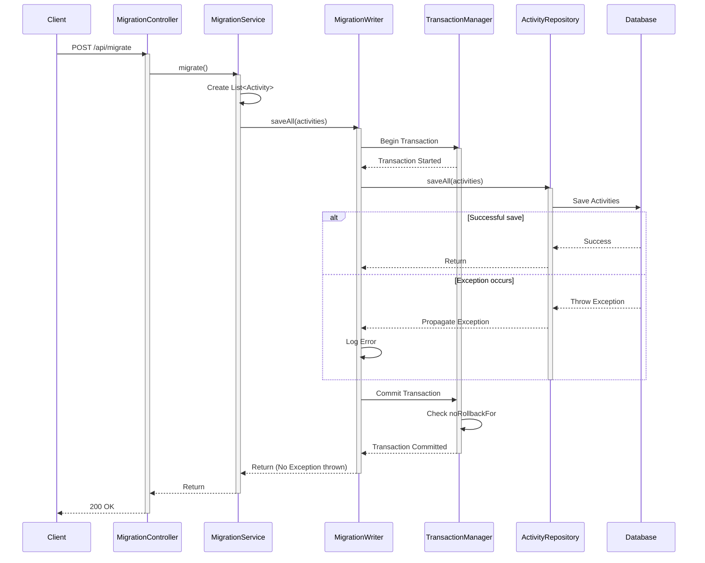

### 문제 상황
내부 트랜잭션에서 예외가 발생하면, 외부 트랜잭션에서 try-catch로 처리해도 전체 트랜잭션이 롤백됨.

### 문제 원인

- Spring의 트랜잭션 관리 메커니즘
- isGlobalRollbackOnParticipationFailure()가 기본적으로 true로 설정됨
- RuntimeException이 발생하면 롤백 마크가 설정됨

### 해결 방법

- Checked Exception 사용
- @Transactional(noRollbackFor = RuntimeException.class) 사용
- @Transactional(propagation = Propagation.REQUIRES_NEW) 사용

---

